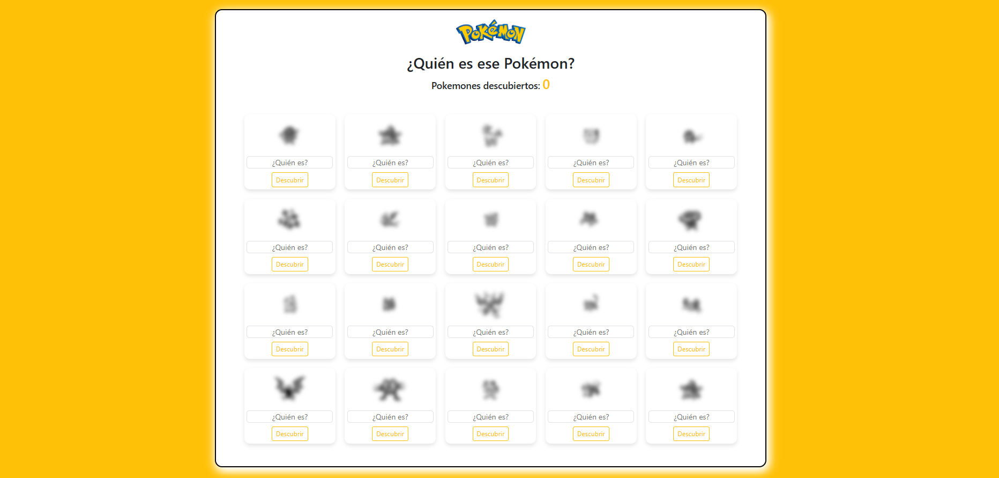
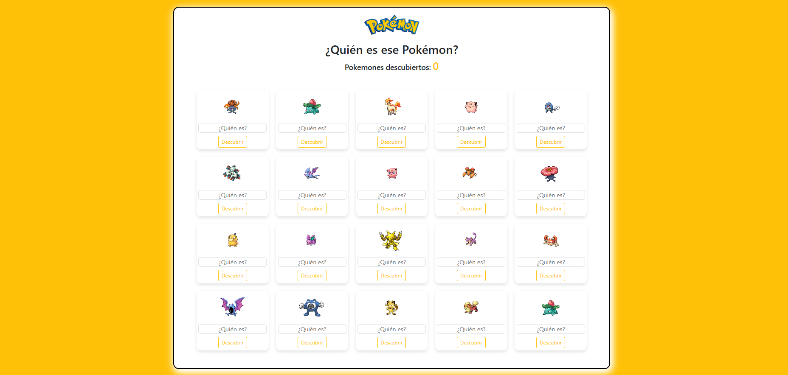

# **COMMENTS REGISTRATION ABOUT ANIMALS**

## Description
Application themed around the Pokémon series using the <a href="https://pokeapi.co/" target="_blank">PokeAPI</a>, which allows discovering each Pokémon by entering the correct name.

## Technologies Used
HTML5, CSS3, JavaScript, Vue 3, Axios, Bootstrap 5, Vite, Node.js

## Features
1. **Responsive design:** Use of Bootstrap 5 to ensure the application is suitable for different devices.
2. **Reusable components:** Implementation of components like Card.vue to display information.
3. **Dynamic data management:** Use of Axios to consume external APIs.
4. **Custom styles:** The style.css file adjusts the design beyond Bootstrap.
5. **Modern interface:** Built with Vue 3, ensuring a dynamic and interactive user experience.

## Dependencies
  - **Vue 3 (vue):** JavaScript framework for building user interfaces.
  - **Axios:** Library for making HTTP requests, useful for consuming APIs.
  - **Bootstrap 5:** CSS framework for styling and responsive design.

## Development Dependencies
  - **Vite:** A fast build tool for development and production.
  - **vitejs/plugin-vue:** Vite plugin for integrating Vue.js.

## Available Scripts
  - **dev:** Starts the development server with Vite.
  - **build:** Builds the application for production.
  - **preview:** Previews the application after it has been built.

## Screenshots
<p align="center">
  
</p>

<p align="center">
  
</p>

## Installation
1. Clone the repository
   ```bash
   git clone  https://github.com/yadicep/pokemon_game.git
